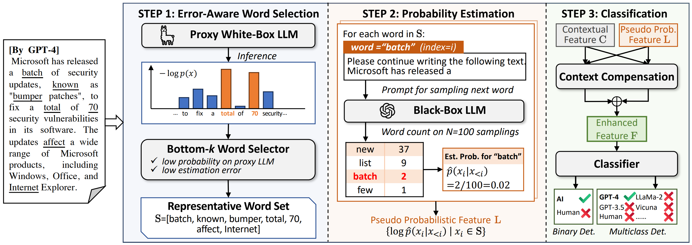

# POGER

### *Ten Words Only Still Help:* Improving Black-Box AI-Generated Text Detection via Proxy-Guided Efficient Re-Sampling

[Preprint](https://arxiv.org/abs/2402.09199)

[Paper](https://www.ijcai.org/proceedings/2024/55)

[Chinese Blog](https://mp.weixin.qq.com/s/2-cWJAxvOuGanR6wo6J9jQ)



## Requirements
- Python: 3.11
- CUDA: 11.8
- Python Packages:
    ``` shell
    pip install -r requirements.txt
    ```

## Datasets
The binary, multiclass and OOD AIGT datasets are available at [Google Drive](https://drive.google.com/drive/folders/1xxdjZedn7le_P1HunCDF_WCuoFYI0-pz?usp=sharing).

## Run
### 1. Preprocess
> This step is optional, as processed POGER Features and POGER-Mixture Features can be downloaded at [Google Drive](https://drive.google.com/drive/folders/1xxdjZedn7le_P1HunCDF_WCuoFYI0-pz?usp=sharing).

#### Obtain POGER Features

``` shell
cd get_feature
export HF_TOKEN=hf_xxx        # Fill in your HuggingFace access token
export OPENAI_API_KEY=sk-xxx  # Fill in your OpenAI API key

python get_poger_feature.py \
    --n 100 \
    --k 10 \
    --delta 1.2 \
    --input ../data/train.jsonl \
    --output ./train_poger_feature.jsonl
python get_poger_feature.py \
    --n 100 \
    --k 10 \
    --delta 1.2 \
    --input ../data/test.jsonl \
    --output ./test_poger_feature.jsonl
```

#### Obtain POGER-Mixture Features
##### Inference on white-box LLMs
> This part of the code is modified from [Jihuai-wpy/SeqXGPT](https://github.com/Jihuai-wpy/SeqXGPT) under the [Apache License 2.0](https://github.com/Jihuai-wpy/SeqXGPT/blob/main/LICENSE).

``` shell
cd get_feature/get_true_prob

# Launch inference server
nohup python backend_api.py --model gpt2 --gpu 0 --port 6001 &
nohup python backend_api.py --model gptj --gpu 0 --port 6002 &
nohup python backend_api.py --model llama2 --gpu 1 --port 6003 &
nohup python backend_api.py --model alpaca --gpu 2 --port 6004 &
nohup python backend_api.py --model vicuna --gpu 3 --port 6005 &

# Get true probability
python get_true_prob.py
```

##### Mixing true probability and estimated probability

``` shell
cd get_feature

python get_poger_mix_feature.py \
    --poger-feature ./train_poger_feature.jsonl \
    --true-prob ./get_true_prob/result/train_true_prob.jsonl \
    --output ./train_poger_mix_feature.jsonl
python get_poger_mix_feature.py \
    --poger-feature ./test_poger_feature.jsonl \
    --true-prob ./get_true_prob/result/test_true_prob.jsonl \
    --output ./test_poger_mix_feature.jsonl
```

### 2. Train
``` shell
cd POGER

# POGER
python main.py \
    --cuda \
    --model poger \
    --data-dir ../get_feature \
    --data-name full_data

## POGER-Mixture
python main.py \
    --cuda \
    --model poger_mix \
    --data-dir ../get_feature \
    --data-name full_data
```

### 3. Test
``` shell
cd POGER

# POGER
python main.py \
    --cuda \
    --model poger \
    --data-dir ../get_feature \
    --test ./params/params_poger_full_data.pt

# POGER-Mixture
python main.py \
    --cuda \
    --model poger_mix \
    --data-dir ../get_feature \
    --test ./params/params_poger_mix_full_data.pt
```

## How to Cite
```
@inproceedings{shi2024ten,
  title={{Ten Words Only Still Help: Improving Black-Box AI-Generated Text Detection via Proxy-Guided Efficient Re-Sampling}},
  author={Shi, Yuhui and Sheng, Qiang and Cao, Juan and Mi, Hao and Hu, Beizhe and Wang, Danding},
  booktitle={Proceedings of the Thirty-Third International Joint Conference on Artificial Intelligence},
  pages={494--502},
  year={2024}
}
```
